# soal-shift-sisop-modul-4-A07-2021

Soal Shift Modul 4 |  Sistem Operasi 2021

1. Zahra Dyah Meilani 05111940000069
2. Ghifari Astaudi' Ukmullah 05111940000012
3. Fairuz Hasna Rofifah 05111940000003

## Soal 1

Membuat encoding dengan ketentuan seperti berikut:

a. Jika sebuah direktori dibuat dengan awalan “AtoZ\_”, maka direktori tersebut akan menjadi direktori ter-encode.

b. Jika sebuah direktori di-rename dengan awalan “AtoZ\_”, maka direktori tersebut akan menjadi direktori ter-encode.

c. Apabila direktori yang terenkripsi di-rename menjadi tidak ter-encode, maka isi direktori tersebut akan terdecode.

d. Setiap pembuatan direktori ter-encode (mkdir atau rename) akan tercatat ke sebuah log. Format : **/home/[USER]/Downloads/[Nama Direktori]** → **/home/[USER]/Downloads/AtoZ\_[Nama Direktori]**

e. Metode encode pada suatu direktori juga berlaku terhadap direktori yang ada di dalamnya (rekursif).

### Penjelasan

#### 1. a.
Pertama, untuk mengecek apakah sebuah direktori dari folder memiliki prefiks 'AtoZ' atau tidak dengan fungsi sebagai berikut:
```C
bool isAtoZ(const char *path) {
    int len = strlen(path);
    for (int i = 0; i < len - 5 + 1; i++) {
        if (path[i] == 'A' && path[i+1] == 't' && path[i+2] == 'o' && path[i+3] == 'Z' && path[i+4] == '_') return true;
    }
    return false;
}
```

Selanjutnya, jika sebuah folder tadi benar diawali "AtoZ" maka akan di-encode dengan Atbash Cipher, fungsi encode-nya adalah seperti berikut:
```C
void encodeAtbash(char *s) {
    for (int i = 0; i < strlen(s); i++) {
        if ('A' <= s[i] && s[i] <= 'Z') s[i] = 'Z'-s[i]+'A';
        else if ('a' <= s[i] && s[i] <= 'z') s[i] = 'z'-s[i]+'a';
    }
}

```
#### 1. b.
Jika terdapat rename folder sehingga berawalan "AtoZ_", maka fungsi `xmp_rename` akan terpanggil. Fungsi ini akan mengecek apakah direktori berawalan dengan "AtoZ_" atau tidak. Jika iya, maka akan di-encode, jika tidak maka akan di-decode dengan fungsi yang ada di 1.c.

```C
static int xmp_rename(const char *from, const char *to, unsigned int flags) {
    int res;
    if (flags) return -EINVAL;
    char fpath[1000], tpath[1000];
    if (strcmp(from, "/") == 0) {
        from = dirpath;
        sprintf(fpath, "%s", from);
    }
    else sprintf(fpath, "%s%s", dirpath, from);
    if (strcmp(to, "/") == 0) {
        to = dirpath;
        sprintf(tpath, "%s", to);
    }
    else sprintf(tpath, "%s%s", dirpath, to);

    // Check if it is folder
    struct stat path_stat;
    stat(fpath, &path_stat);
    if (!S_ISREG(path_stat.st_mode)) {
        // If the folder is encoded and will be decoded
        // Rename AtoZ to A_is_a_
        if (isAtoZ(fpath) && isAisA(tpath)) {
            decodeFolderRecursively(fpath, 0);
            #if defined DEBUG_MODE
            printf("[QAQ] Decoding %s with depth = 0.\n", fpath);
            #endif
        }
        // Rename A_is_a_ to AtoZ
        else if (isAisA(fpath) && isAtoZ(tpath)) {
            encodeFolderRecursively(fpath, 0);
            #if defined DEBUG_MODE
            printf("[QAQ] Encoding %s with depth = 0.\n", tpath);
            #endif
        }
        else if (isAtoZ(fpath) && !isAtoZ(tpath)) {
            #if defined DEBUG_MODE
            printf("[QAQ] Decoding %s.\n", fpath);
            #endif
            // logEncode(fpath, tpath, "RENAME", 1);
            int count = decodeFolderRecursively(fpath, INF);
            #if defined DEBUG_MODE
            printf("[QAQ] Total decoded file : %d\n", count);
            #endif
        }
        // Else if the folder is decoded and will be encoded
        else if (!isAtoZ(fpath) && isAtoZ(tpath)) {
            #if defined DEBUG_MODE
            printf("[QAQ] Encoding %s.\n", fpath);
            #endif
            logEncode(fpath, tpath, "RENAME", 1);
            int count = encodeFolderRecursively(fpath, INF);
            #if defined DEBUG_MODE
            printf("[QAQ] Total encoded file : %d\n", count);
            #endif
        }
        // Rename RX_ to A_is_a_
        else if (isRX(fpath) && isAisA(tpath)) {
            decodeFolderRecursivelyRXrn(fpath, 0);
        }
        // Rename A_is_a to RX_
        else if (isAisA(fpath) && isRX(tpath)) {
            encodeFolderRecursivelyRXrn(fpath, 0);
        }else if(!isRX(fpath) && isRX(tpath)){
            encodeFolderRecursivelyRXrn(fpath, INF);
        }else if(isRX(fpath) && !isRX(tpath)){
            decodeFolderRecursivelyRXrn(fpath, INF);
        }
    }

    logAll(fpath, tpath, "RENAME", 1);

    res = rename(fpath, tpath);
    if (res == -1) return -errno;
    return 0;
}
```

#### 1. c.
Sedangkan untuk decode-nya, hampir sama seperti fungsi encode karena rumus dari Atbash cipher sendiri sama untuk encode dan decode-nya:
```C
void decodeAtbash(char *s) {
    // Decode Atbash Cipher string
    for (int i = 0; s[i]; i++) {
        if ('A' <= s[i] && s[i] <= 'Z') s[i] = 'A'-s[i]+'Z';
        else if ('a' <= s[i] && s[i] <= 'z') s[i] = 'a'-s[i]+'z';
    }
}
```
#### 1. d.
Kemudian untuk melakukan logging encode dari soal ini adalah sebagai berikut:
```C
void logEncode(char *dir1, char *dir2, char *cmd, int type) {
    char buff[1024];

    FILE *out = fopen(logpath, "a");
    if(cmd == "RENAME") {
        fprintf(out, "%s → %s\n", dir1, dir2);
    } else {
        fprintf(out, "%s\n", dir2);
    }
    fclose(out);
}
```
Jika terdapat pembuatan folder atau rename di folder yang berawalan AtoZ akan tercatat pada log dengan format : **/home/[USER]/Downloads/[Nama Direktori]** → **/home/[USER]/Downloads/AtoZ\_[Nama Direktori]**.

#### 1.e.

Untuk membuat encoding dapat berjalan rekursif hingga ke subdirektorinya, kita membuat fungsi sebagai berikut:
```C
int encodeFolderRecursively(char *basePath, int depth) {
    char path[1000];
    struct dirent *dp;
    DIR *dir = opendir(basePath);
    if (!dir) return 0;
    int count = 0;
    while ((dp = readdir(dir)) != NULL) {
        if (strcmp(dp->d_name, ".") == 0 || strcmp(dp->d_name, "..") == 0) continue;
        strcpy(path, basePath);
        strcat(path, "/");
        strcat(path, dp->d_name);

        struct stat path_stat;
        stat(path, &path_stat);
        if (!S_ISREG(path_stat.st_mode)) {
            // Folder
            if (depth > 0) {
                count += encodeFolderRecursively(path, depth - 1);
                encodeFolderName(basePath, dp->d_name);
            }
        }
        else {
            // File
            if (encodeFile(basePath, dp->d_name) == 0) count++;
        }
    }
    closedir(dir);
    return count;
}
```

dan untuk decode-nya:
```C
int decodeFolderRecursively(char *basePath, int depth) {
    char path[1000];
    struct dirent *dp;
    DIR *dir = opendir(basePath);
    if (!dir) return 0;
    int count = 0;
    while ((dp = readdir(dir)) != NULL) {
        if (strcmp(dp->d_name, ".") == 0 || strcmp(dp->d_name, "..") == 0) continue;
        strcpy(path, basePath);
        strcat(path, "/");
        strcat(path, dp->d_name);

        struct stat path_stat;
        stat(path, &path_stat);
        if (!S_ISREG(path_stat.st_mode)) {
            // Folder
            if (depth > 0) {
                count += decodeFolderRecursively(path, depth - 1);
                decodeFolderName(basePath, dp->d_name);
            }
        }
        else {
            // File
            if (decodeFile(basePath, dp->d_name) == 0) count++;
        }
    }
    closedir(dir);
    return count;
}
```

### Screenshot
Sebelum rename:

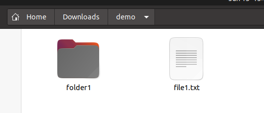

Setelah rename:

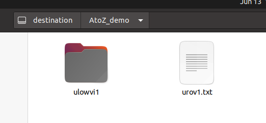

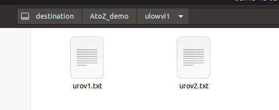

Log:
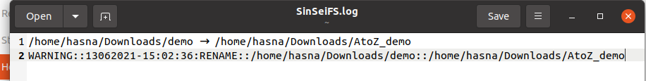

### Kendala

Decode dan encode belum bisa berjalan pada fungsi mkdir.
## Soal 2
Enkripsi tambahan
a. Jika sebuah direktori dibuat dengan awalan “RX_[Nama]”, maka direktori
tersebut akan menjadi direktori terencode beserta isinya dengan perubahan nama isi sesuai kasus nomor 1 dengan algoritma tambahan ROT13 (Atbash + ROT13).

b. Jika sebuah direktori di-rename dengan awalan “RX_[Nama]”, maka direktori
tersebut akan menjadi direktori terencode beserta isinya dengan perubahan
nama isi sesuai dengan kasus nomor 1 dengan algoritma tambahan Vigenere
Cipher dengan key “SISOP” (Case-sensitive, Atbash + Vigenere).

c. Apabila direktori yang terencode di-rename (Dihilangkan “RX_” nya), maka folder
menjadi tidak terencode dan isi direktori tersebut akan terdecode berdasar nama
aslinya.

d. Setiap pembuatan direktori terencode (mkdir atau rename) akan tercatat ke
sebuah log file beserta methodnya (apakah itu mkdir atau rename).

e. Pada metode enkripsi ini, file-file pada direktori asli akan menjadi terpecah
menjadi file-file kecil sebesar 1024 bytes, sementara jika diakses melalui
filesystem rancangan Sin dan Sei akan menjadi normal. Sebagai contoh,
Suatu_File.txt berukuran 3 kiloBytes pada directory asli akan menjadi 3 file kecil
yakni:

Suatu_File.txt.0000

Suatu_File.txt.0001

Suatu_File.txt.0002

Ketika diakses melalui filesystem hanya akan muncul Suatu_File.txt

### Penjelasan
#### 2.a.
Untuk mengetahui apakah sebuah folder memiliki nama dengan awalan'RX_', kita gunakan fungsi yang dapat mengeceknya dan mengembalikan nilai True atau False sebagai berikut
```C
bool isRX(const char *path) {
    int len = strlen(path);
    for (int i = 0; i < len - 3 + 1; i++) {
        if (path[i] == 'R' && path[i+1] == 'X' && path[i+2] == '_') return true;
    }
    return false;
}
```

Untuk melakukan encoding pada file yang baru dibuat dengan berawalan 'RX_', kita gunakan fungsi yang menerapkan algoritma Atbash + ROT13 sebagai berikut
```C
void encodeAtbash(char *s) {
    for (int i = 0; i < strlen(s); i++) {
        if ('A' <= s[i] && s[i] <= 'Z') s[i] = 'Z'-s[i]+'A';
        else if ('a' <= s[i] && s[i] <= 'z') s[i] = 'z'-s[i]+'a';
    }
}

void encodeROT13(char *s) {
    for (int i = 0; s[i]; i++) {
        if ('A' <= s[i] && s[i] <= 'Z') s[i] = ((s[i]-'A'+13)%26)+'A';
        else if ('a' <= s[i] && s[i] <= 'z') s[i] = ((s[i]-'a'+13)%26)+'a';
    }
}
```
#### 2. b.
Untuk melakukan encoding pada folder yang di-rename menjadi berawalan "RX_", kita gunakan algoritma Atbash + Vigenere dengan keyword "SISOP" sebagai berikut:
```C
void encodeAtbash(char *s) {
    for (int i = 0; i < strlen(s); i++) {
        if ('A' <= s[i] && s[i] <= 'Z') s[i] = 'Z'-s[i]+'A';
        else if ('a' <= s[i] && s[i] <= 'z') s[i] = 'z'-s[i]+'a';
    }
}

void encodeVig(char *s) {
    
    char key[] = "SISOP";
    for (int i = 0; s[i]; i++) {
    	
        if ('A' <= s[i] && s[i] <= 'Z') s[i] = ((s[i]-'A'+(key[i%((sizeof(key)-1))]-'A'))%26)+'A';
        else if ('a' <= s[i] && s[i] <= 'z') s[i] = ((s[i]-'a'+(key[i%((sizeof(key)-1))]-'A'))%26)+'a';
    }
}
```

#### 2. c.
Untuk melakukan decode digunakan fungsi-fungsi berikut:
```C

void decodeAtbash(char *s) {
    for (int i = 0; s[i]; i++) {
        if ('A' <= s[i] && s[i] <= 'Z') s[i] = 'A'-s[i]+'Z';
        else if ('a' <= s[i] && s[i] <= 'z') s[i] = 'a'-s[i]+'z';
    }
}

void decodeROT13(char *s) {
    for (int i = 0; s[i]; i++) {
        if ('A' <= s[i] && s[i] <= 'Z') s[i] = ((s[i]-'A'-13)%26)+'A';
        else if ('a' <= s[i] && s[i] <= 'z') s[i] = ((s[i]-'a'-13)%26)+'a';
    }
}

void decodeVig(char *s) {
    char key[] = "SISOP";
    for (int i = 0; s[i]; i++) {
        if ('A' <= s[i] && s[i] <= 'Z') s[i] = ((s[i]-'A'-(key[i%((sizeof(key)-1))]-'A')+26)%26)+'A';
        else if ('a' <= s[i] && s[i] <= 'z') s[i] = ((s[i]-'a'-(key[i%((sizeof(key)-1))]-'A')+26)%26)+'a';
    }
}
```

#### 2. d.
Untuk mencatat ke log jika terjadi encoding maka digunakan fungsi berikut
```C
void logEncode(char *dir1, char *dir2, char *cmd, int type) {
    char buff[1024];

    FILE *out = fopen(logpath, "a");
    if(cmd == "RENAME") {
        fprintf(out, "%s → %s\n", dir1, dir2);
    } else {
        fprintf(out, "%s\n", dir2);
    }
    fclose(out);

}
```

### Screenshot
Sebelum rename:


Setelah rename:

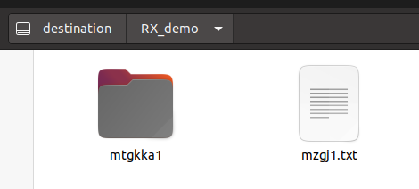

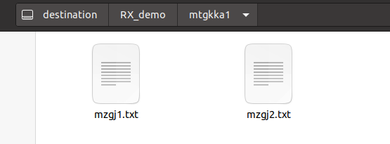

### Kendala

1. Decode dan encode belum bisa berjalan pada fungsi mkdir.
2. Pada nomer 2e belum dapat diselesaikan karena kurangnya waktu dan ide cara pengerjaan yang dapat digunakan untuk mengatasi hal tersebut. Meskipun begitu terdapat ide untuk melakukan manipulasi file pada bagian readdir tetapi karena kurang petunjuk kami ragu untuk mengimplementasikannya.
## Soal 3

a. Jika sebuah direktori dibuat dengan awalan “A_is_a_”, maka direktori tersebut akan menjadi sebuah direktori spesial.

b. Jika sebuah direktori di-rename dengan memberi awalan “A_is_a_”, maka direktori tersebut akan menjadi sebuah direktori spesial.

c. Apabila direktori yang terenkripsi di-rename dengan menghapus “A_is_a_” pada bagian awal nama folder maka direktori tersebut menjadi direktori normal.

d. Direktori spesial adalah direktori yang mengembalikan enkripsi/encoding pada
direktori “AtoZ_” maupun “RX_” namun masing-masing aturan mereka tetap berjalan pada direktori di dalamnya (sifat recursive “AtoZ_” dan “RX_” tetap
berjalan pada subdirektori).

e. Pada direktori spesial semua nama file (tidak termasuk ekstensi) pada fuse akan
berubah menjadi lowercase insensitive dan diberi ekstensi baru berupa nilai desimal dari binner perbedaan namanya.

Contohnya jika pada direktori asli nama filenya adalah “FiLe_CoNtoH.txt” maka
pada fuse akan menjadi “file_contoh.txt.1321”. 1321 berasal dari biner

### Penjelasan

#### 3. a.
Dilakukan pengecekan sebuah direktori, apakah termasuk direktori spesial atau bukan dengan menggunakan fungsi `isAisA` sebagai berikut:
```C
bool isAisA(const char *path) {
    for (int i = strlen(path) - 1; i >= 7; i--) {
        if (path[i-7] == 'A' && 
            path[i-6] == '_' && 
            path[i-5] == 'i' &&
            path[i-4] == 's' &&
            path[i-3] == '_' &&
            path[i-2] == 'a' && 
            path[i-1] == '_') {
                return true;
            }
    }
    return false;
}
```

#### 3. b. dan 3. c.
Ketika terjadi rename, maka fungsi `xmp_rename` akan terpanggil dan akan melakukan pengecekan pada folder tersebut, dengan membandingkan nama awal dan nama akhirnya, dari situ kita tahu apakah sebuah folder itu awalnya tidak spesial menjadi spesial, atau sebaliknya.


#### 3. d.
Ketika folder yang tidak spesial atau berawalan "AtoZ_" atau "RX_" di-rename menjadi folder spesial "A_is_a", maka digunakan fungsi `decodeFolderRecursively` dengan depth = 0 supaya proses decode hanya berlaku pada file yang berada di dalamnya. 

Ketika folder spesial di-rename menjadi folder "AtoZ_" atau "RX_", maka digunakan fungsi  `encodeFolderRecursively` dengan depth = 0 supaya proses encode hanya berlaku pada file yang berada di dalamnya.

### Screenshot
Sebelum rename:
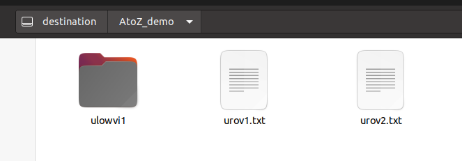

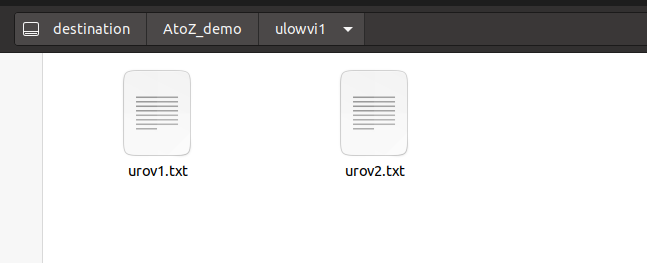

Setelah rename:
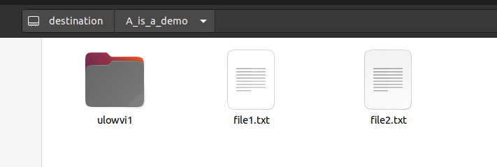

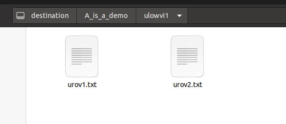

### Kendala
Kesulitan dalam menjadikan lowercase insensitive dan mengubah ekstensi dari desimal binner perbedaan namanya.
## Soal 4

Untuk memudahkan dalam memonitor kegiatan pada filesystem mereka Sin dan Sei
membuat sebuah log system dengan spesifikasi sebagai berikut.

a. Log system yang akan terbentuk bernama “SinSeiFS.log” pada direktori home
pengguna (/home/[user]/SinSeiFS.log). Log system ini akan menyimpan daftar
perintah system call yang telah dijalankan pada filesystem.

b. Karena Sin dan Sei suka kerapian maka log yang dibuat akan dibagi menjadi dua
level, yaitu INFO dan WARNING.

c. Untuk log level WARNING, digunakan untuk mencatat syscall rmdir dan unlink.

d. Sisanya, akan dicatat pada level INFO.

e. Format untuk logging yaitu:

[Level]::[dd][mm][yyyy]-[HH]:[MM]:[SS]:[CMD]::[DESC :: DESC]

Level : Level logging, dd : 2 digit tanggal, mm : 2 digit bulan, yyyy : 4 digit tahun,
HH : 2 digit jam (format 24 Jam),MM : 2 digit menit, SS : 2 digit detik, CMD :

System Call yang terpanggil, DESC : informasi dan parameter tambahan
INFO::28052021-10:00:00:CREATE::/test.txt
INFO::28052021-10:01:00:RENAME::/test.txt::/rename.txt

### Penjelasan

Untuk pembuatan log, akan dibuat dua tipe yaitu log untuk tipe INFO dan tipe WARNING, untuk mendapatkan tanggal kami menggunakan fungsi dari time_t sebagai berikut.

```C
void logInfo(char *command, char *desc) {
    time_t t = time(NULL);
    struct tm* lt = localtime(&t);

    char currTime[TIME_SIZE];
    strftime(currTime, TIME_SIZE, "%d%m%Y-%H:%M:%S", lt);

    char log[LOG_SIZE];
    sprintf(log, "%s::%s:%s::%s", warn, currTime, command, desc);

    FILE *out = fopen(logpath, "a");
    fprintf(out, "%s\n", log);
    fclose(out);

    return;
}

void logWarn(char *command, char *desc) {
    time_t t = time(NULL);
    struct tm* lt = localtime(&t);

    char currTime[TIME_SIZE];
    strftime(currTime, TIME_SIZE, "%d%m%Y-%H:%M:%S", lt);

    char log[LOG_SIZE];
    sprintf(log, "%s::%s:%s::%s", warn, currTime, command, desc);

    FILE *out = fopen(logpath, "a");
    fprintf(out, "%s\n", log);
    fclose(out);

    return;
}
```

### Screenshot
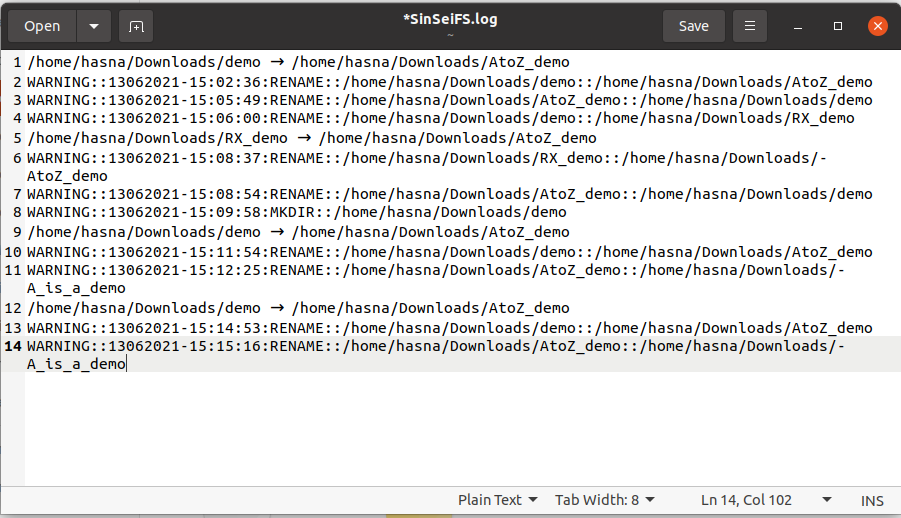

### Kendala
Tidak ada kendala dalam soal 4.